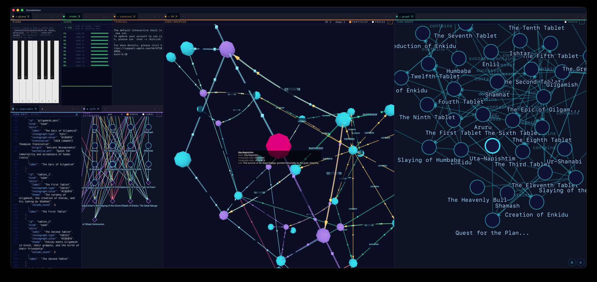
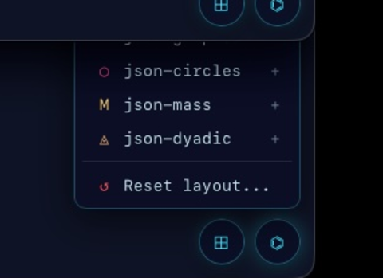

# Exoskeleton

A cross-platform desktop workspace built on Tauri 2 and Dockview — structure you operate inside while you work. Not a tool you switch to; a chassis your tools live in. Targets macOS Apple Silicon and Linux.

Licensed under the **GNU Affero General Public License v3.0 or later** ([AGPL-3.0-or-later](LICENSE)).



---

## Why this is different

Draw the same network twice and you get two different pictures — not because
one is wrong, but because there's no single correct way to flatten a tangle of
connections onto a screen. Every layout makes some relationships obvious and
hides others. Most software picks one arrangement and commits to it.

Exoskeleton runs several graph layouts of the same source at once — 2D force,
cytoscape/fcose, 3D force — and keeps them synchronized by **identity rather
than position**. Hover a node in one panel and the same node lights up in the
others. Click it and each panel flies its own camera to that node, in its own
coordinate space, preserving its own embedding. Nothing positional ever
crosses a panel boundary — a sync event names a node; each renderer resolves
that name independently. A node that sits among one crowd in one layout and a
different crowd in another is telling you something neither layout could have
told you alone.

Camera moves animate rather than cut (a tuned transition per renderer), so
each panel stays a place you learn across many selections instead of
re-encountering from scratch on every click.

See [docs/cross-panel-sync.md](docs/cross-panel-sync.md) for the technical
contract, the design rationale, and an honest status table of what's wired up
today versus what the architecture merely makes possible.

---

## What's in the Box

A running Exoskeleton gives you:

- **Dockable Workspace Grid**: Drag, dock, tab, split, resize, and pop out panels into separate OS windows.
- **Workspaces (Schema v8)**: Create, rename, delete, switch between multiple named workspaces, export/import standalone `.exo.json` workspace documents, and open independent workspaces in separate OS windows.
- **Layout Presets**: Instantly switch or reset to curated workspace layouts (**Minimal**, **JSON Lab**, **AV Lab**, **Everything**).
- **Sixteen Built-in Panels**:
  - **Editor**: Markdown text editor with native file save/open.
  - **Terminal**: Real-shell terminal powered by xterm.js + `tauri-plugin-pty` with shell auto-resolution.
  - **Web Viewport**: In-app web browser viewport with URL bar for LAN services and docs.
  - **JSON Suite**: CodeMirror 6 JSON editor (featuring Midnight Alaska theme and file path persistence) feeding visualizers over an in-process `json-bus`:
    - **JSON Tree**: Interactive node inspector.
    - **JSON Circles**: SVG radial cluster visualization.
    - **JSON Mass**: Physics particle gravity simulation.
    - **JSON Cytoscape**: Network graph layout.
    - **JSON Graph**: Force-directed 2D graph.
    - **JSON Graph 3D**: Three.js 3D force graph.
    - **JSON Dyadic**: Category & dyadic link topology graph parser.
  - **AV Suite**:
    - **Tempo Clock**: Visual tempo & beat ticker.
    - **Piano**: Interactive web audio synthesizer keyboard.
    - **Oscilloscope**: Real-time Web Audio API frequency/waveform scope.
  - **Settings & Status Bar**: Raw JSON state inspector/editor in side-grid and status bar.
- **Fault-Tolerant Panel Error Boundaries**: Any uncaught JS error in a panel is caught safely, preserving the main workspace grid and offering **Retry** and **Close Panel** options.
- **Persistence & Auto-Save**: Debounced flush on state changes, window close, and app unload. Stored as schema v8 JSON in `~/Library/Application Support/dev.harold.exoskeleton/`.

---

## Stack

| Concern | Choice |
| --- | --- |
| Shell / Window | [Tauri 2](https://v2.tauri.app/) (Rust) |
| UI Framework | React 19 + TypeScript |
| Layout / Docking | [Dockview 6](https://dockview.dev) |
| Code Editor | [CodeMirror 6](https://codemirror.net/) (`@codemirror/lang-json`) |
| Terminal Frontend | [`@xterm/xterm`](https://www.npmjs.com/package/@xterm/xterm) v6 |
| Terminal Backend | [`tauri-plugin-pty`](https://github.com/Tnze/tauri-plugin-pty) via [`tauri-pty`](https://www.npmjs.com/package/tauri-pty) |
| Persistence | `@tauri-apps/plugin-store` + custom v8 schema migrator |
| Logging | `tauri-plugin-log` (unified Rust & JS logging) |
| License | GNU AGPL-3.0-or-later |

---

## Installing a release build

Grab the build for your platform from the [Releases](../../releases) page.

### macOS

Exoskeleton is **not code-signed** (no Apple Developer Program membership yet — see [docs/signing.md](docs/signing.md) for the reversible path to fixing that). Because of this, macOS Gatekeeper will refuse to open it and call it "damaged" — that's quarantine, not an actual problem with the download. After installing the `.app` into `/Applications`, clear the quarantine flag once from Terminal:

```bash
xattr -dr com.apple.quarantine /Applications/Exoskeleton.app
```

Then launch it normally. You only need to do this once per install.

### Linux (AppImage)

Make the AppImage executable before running it:

```bash
chmod +x Exoskeleton_*.AppImage
./Exoskeleton_*.AppImage
```

---

## First run

On first launch Exoskeleton opens with the **Minimal** preset: just the editor, terminal, and web viewport. The other thirteen panels aren't gone — they're one click away. Click the **⊞** button in the bottom floating toolbar to:

- add any panel from the full registry,
- switch to a different preset (**JSON Lab**, **AV Lab**, **Everything**),
- create, rename, or delete named workspaces,
- export or import a workspace as a portable `.exo.json` file.



The **Watermark** screen (shown whenever the active workspace's grid is empty) offers the same preset choices as a set of cards.

### Resetting to a known-good layout

You never need to leave the app or touch Finder to recover from a messy grid:

- **⊞ menu → "Reset layout to preset…"** — reachable at any time, asks for confirmation, and resets only the active workspace.
- If the app itself won't launch usefully, delete the state file and relaunch: `~/Library/Application Support/dev.harold.exoskeleton/` (macOS) or the platform-equivalent app-data directory on Linux.

---

## Quick Start (development)

### Prerequisites

- **Node.js**: 20+
- **Rust**: 1.77+
- **macOS**: Xcode Command Line Tools
- **Linux (Pop!_OS / Ubuntu)**: Tauri Linux dependencies (`libwebkit2gtk-4.1-dev`, `build-essential`, `curl`, `libssl-dev`, `libayatana-appindicator3-dev`, `librsvg2-dev`)

### Run Development Build

```bash
npm install
npm run tauri dev
```

First Rust compile is **5–15 min**; subsequent runs are seconds.

### Build Production App

```bash
npm run build
npm test
npm run tauri build
```

---

## Workspaces & `.exo.json` Documents

Exoskeleton schema v8 introduces multi-workspace support and workspace document portable serialization.

- **Workspace Switcher**: Click the **⊞** button in the bottom floating toolbar to switch between saved workspaces, create new ones, rename, or delete.
- **Export / Import**: Save any workspace configuration as a portable `.exo.json` file to share or back up, and import `.exo.json` files seamlessly. Imported files are treated as untrusted: any file path a panel had open is dropped on import, so importing someone else's workspace never silently opens a file from your machine — you re-open documents yourself if you want them.
- **Multi-Window Workspaces**: Click **❐** next to any workspace to open it in a separate, independent OS window.

---

## Project Structure

```
exoskeleton/
├── .github/
│   └── workflows/ci.yml             GitHub Actions CI pipeline
├── src/                             React frontend
│   ├── App.tsx                      Main application manifest & workspace state coordinator
│   ├── PanelRoot.tsx                PanelErrorBoundary wrapper HOC
│   ├── ColoredTab.tsx               Tab glyph & accent stripe renderer
│   ├── Watermark.tsx                Empty workspace preset selector UI
│   ├── HeaderActions.tsx            Dockview tab header controls
│   ├── data/                        In-process data bus (json-bus)
│   ├── panels/                      Workspace panel implementations
│   │   ├── EditorPanel.tsx          Markdown editor
│   │   ├── TerminalPanel.tsx        xterm.js PTY terminal shell
│   │   ├── LanWebview.tsx           Web iframe viewport
│   │   ├── json-edit/               CodeMirror 6 JSON editor panel
│   │   ├── json-tree/               Tree view visualizer
│   │   ├── json-circles/            Radial cluster visualizer
│   │   ├── json-mass/               Physics mass visualizer
│   │   ├── json-cytoscape/          Cytoscape graph visualizer
│   │   ├── json-graph/              2D force graph visualizer
│   │   ├── json-graph3d/            3D Three.js graph visualizer
│   │   └── json-dyadic/             Category/dyadic topology graph visualizer
│   ├── persistence/                 Save/load, workspace storage v8 & presets
│   │   ├── storage.ts               AppStateV8 & Workspace schema definition
│   │   ├── workspace-file.ts        .exo.json document export/import validation
│   │   ├── presets.ts               Minimal, JSON Lab, AV Lab, Everything presets
│   │   ├── default-layout.ts        Default arrangement & applyWorkspaceState()
│   │   └── tauri-storage.ts         Tauri store adapter
│   └── utils/
│       └── debounce.ts              Debouncer with flush() & cancel()
├── src-tauri/                       Rust Tauri backend
│   ├── src/lib.rs                   Tauri plugins, open_workspace_window command
│   ├── capabilities/default.json    Tauri permissions (fs, dialog, pty, store, log)
│   ├── tauri.conf.json              Content Security Policy (CSP) & app config
│   └── Cargo.toml
├── docs/
│   ├── cross-panel-sync.md          Identity-based graph sync: contract & rationale
│   ├── ship-plan.md                 Exoskeleton release plan
│   ├── SESSIONS.md                  Handoff & session execution log
│   └── signing.md                   macOS signing & notarization guide
├── LICENSE                          GNU AGPL-3.0-or-later license text
├── package.json
└── vite.config.ts
```

---

## Testing & Quality Assurance

Run the test suite locally:

```bash
npm test
```

This runs unit tests covering:
- Topology graph parsing & category mode determination
- Shell resolution (`resolveShell`)
- Auto-add panel migration rules (`panelsToAutoAdd`)
- Layout presets (`presets.ts`)
- Schema compatibility & v8 migration (`storage.ts`, `workspace.test.ts`)
- `.exo.json` workspace file serialization & parsing (`workspace-file.test.ts`)
- Debounce `.flush()` and `.cancel()` controls (`debounce.test.ts`)

---

## License

Exoskeleton is free software licensed under the **GNU Affero General Public License v3.0 or later** ([AGPL-3.0-or-later](LICENSE)).

Use it, fork it, study it, ship it — including commercially, as long as a derived work (or a modified version run as a network service) also releases its source under the AGPL. If you want to build something proprietary on top of Exoskeleton instead, commercial licenses are available separately: email halapenyoharry@gmail.com.

See [CONTRIBUTING.md](CONTRIBUTING.md) before opening a pull request — dual licensing only works while contributions carry a clear inbound grant.

---

# Forking Exoskeleton

Everything below this line is the fork-and-build guide: how the app is put together, how to add your own panel, and what isn't built yet. If you want to make your own desktop workspace by editing Exoskeleton, this is the entry point.

## How it's put together

Exoskeleton starts empty. Tauri gives you an OS window. Inside the window is a WebView — a small embedded browser surface. React mounts inside the WebView. Dockview, a layout library, mounts inside React. At that moment you have a **grid** — a splittable canvas — and it has nothing in it.

What turns the empty grid into the workspace you see is one file: [src/App.tsx](src/App.tsx). It's the manifest. Read it and you know what this app *is*.

### The manifest

Two things in `App.tsx` matter.

**First, a map from names to React components:**

```ts
const components = {
  editor: EditorPanel,
  terminal: TerminalPanel,
  webview: LanWebview,
};
```

The left side of each pair is the *role*. The right side is the *implementation* — the React component that fills the role. The role is stable; the implementation is swappable. That's why `WebviewPanel` could be renamed to `LanWebview` without changing anything else — the role kept its name and color.

**Second, an `onReady` function** — what Dockview runs once the grid is mounted but empty:

```ts
event.api.addPanel({ id: "editor", component: "editor", title: "editor" });
event.api.addPanel({ id: "webview",  ..., position: { referencePanel: "editor", direction: "right" } });
event.api.addPanel({ id: "terminal", ..., position: { referencePanel: "editor", direction: "below" } });
```

Three calls. The first fills the empty grid. The second cuts the grid side-to-side. The third splits the left half top-to-bottom. The arrangement that results is the one you see on first launch. (`direction: "within"` is also available — it adds a panel *as a tab inside an existing group* rather than splitting.)

### Forking it: adding your own panel

The recipe is two edits to [src/App.tsx](src/App.tsx):

1. Add an entry to the `components` map: `notes: NotesPanel`.
2. Add an `addPanel` call in `onReady` telling Dockview where to put it.

The component itself comes from one of three places, in increasing order of effort:

- **npm.** `npm install some-react-component`, import it, drop it in the map.
- **Your own file** under [src/panels/](src/panels/), modeled on the existing panels.
- **A Tauri plugin**, if the thing needs to reach outside the WebView — filesystem, notifications, subprocesses, system dialogs. Plugins are registered in [src-tauri/Cargo.toml](src-tauri/Cargo.toml) and granted permission in [src-tauri/capabilities/default.json](src-tauri/capabilities/default.json). Today's plugins (`fs`, `dialog`, `opener`, `pty`, `store`, `log`) are why the editor can save files, the terminal runs a real shell, layouts persist, and logs land in one place.

### Three rules for when a new thing earns a panel

Panels are first-class citizens, not afterthoughts. Before adding another one, ask:

- **Does it have continuous state?** A panel persists across focus switches and coffee breaks — an open file, a shell session, a loaded URL. If the thing only matters while you're looking at it, it's a modal, not a panel.
- **Is it a distinct mode of work?** A second terminal isn't a new mode — it's a tab inside the existing `terminal` panel.
- **Is there a color slot for it?** The accent in peripheral vision is how the user knows which mode they're in without focused attention. Adding accents indefinitely dilutes that; the right question is usually "should I retire one of the four?", not "should I add a fifth?"

Pass all three and the thing earns its own panel. Pass two and it's a tab inside an existing one. Pass one and it's a modal.

### The schema/state split

Two strict rules that keep things organized:

1. **Schema lives in code.** What panels are *possible*, what colors they get, what their default arrangement is — that's in `App.tsx` and the panel component files.
2. **State lives in one JSON file.** What's *currently* arranged, what each panel currently holds, what preferences are set — that's a single JSON in the OS app-data dir.

State is always a delta on top of schema. Forking the schema (adding a panel) doesn't break existing users' state. Resetting is one operation: delete the state file.

| File | What it tells you |
| --- | --- |
| [src/App.tsx](src/App.tsx) | which panels exist and the default arrangement |
| [package.json](package.json) | what React-side parts are available |
| [src-tauri/Cargo.toml](src-tauri/Cargo.toml) | what system powers the app has |
| `~/Library/Application Support/dev.harold.exoskeleton/exoskeleton.json` | the current user state on disk |

### The side-grid

Beyond the main grid, Exoskeleton has a **side-grid** — a separate Dockview instance that lives on the left side of the window. Toggleable with **⌘B** (or **Ctrl+B**). Hidden by default.

The side-grid is where *controls* live — things that operate *on* the workspace rather than being content of it. Today it holds one panel: a raw JSON editor showing the current app state. Tomorrow it can hold themes, command palettes, debug logs, anything you'd typically put in a sidebar.

The main grid and the side-grid are **peers**: two independent Dockview instances in the same window. They have their own state, their own drag-and-drop scope (you can't drag a tab across the boundary), and their own visibility. They share the same persistence file under separate keys.

The side-grid lives in [src/sidegrid/](src/sidegrid/) — `SideGrid.tsx` is the mini-Dockview wrapper, `SettingsPanel.tsx` is the JSON editor inside it.

### Chrome customization

Dockview has five places where you can replace the default rendering:

| Slot | What it controls | Where in this codebase |
| --- | --- | --- |
| `defaultTabComponent` | What a tab looks like | [ColoredTab.tsx](src/ColoredTab.tsx) — glyph + accent color via CSS variable |
| `watermarkComponent` | What's shown when the grid is empty | [Watermark.tsx](src/Watermark.tsx) for main, [SideGridWatermark.tsx](src/sidegrid/SideGridWatermark.tsx) for side |
| `prefixHeaderActionsComponent` | The bar *before* the tabs | [HeaderActions.tsx](src/HeaderActions.tsx) — a glowing accent dot |
| `leftHeaderActionsComponent` | The bar *after* the tabs, on the left | [HeaderActions.tsx](src/HeaderActions.tsx) — `+` button that adds a tab of the same kind |
| `rightHeaderActionsComponent` | The bar on the right of the header | [HeaderActions.tsx](src/HeaderActions.tsx) — `⤴` popout + `⨯` close-group |

There's no single `headerComponent` slot in Dockview. A fully custom header is built by composing the four slots above with custom `tabComponents`.

### Persistence

State is saved automatically. Every time a panel is dragged/closed/resized, the active panel changes, a panel's parameters change, or the side-grid visibility flips, Exoskeleton debounces 400ms and writes to:

```
~/Library/Application Support/dev.harold.exoskeleton/exoskeleton.json
```

`version` tracks the schema — when it changes incompatibly, increment `CURRENT_VERSION` in `storage.ts` and write a migration. Mismatched-version state falls back to defaults silently (with a console warning). Schema v8 introduced named workspaces — see [Workspaces & .exo.json Documents](#workspaces--exojson-documents) above.

**To reset to defaults**: delete `exoskeleton.json` and relaunch, or use the in-app "Reset layout to preset…" action.

The persistence layer in [src/persistence/](src/persistence/) is split into small files so it's portable:
- `storage.ts` — environment-agnostic interface + `AppState` type.
- `tauri-storage.ts` — Tauri adapter (today).
- `default-layout.ts` — the default panel arrangement and presets.
- `presets.ts` — the named layout presets.
- `workspace-file.ts` — `.exo.json` export/import.

To run Exoskeleton in a browser or VSCode webview later, write `web-storage.ts` (localStorage / IndexedDB) or `vscode-storage.ts` (webview message passing → `globalState`), branch in `App.tsx` to pick the adapter at runtime, and the rest of the code doesn't know which backend it's talking to.

### Multi-window

Two independent multi-window mechanisms exist — keep them separate:

- **Popout group** (**⤴** in a group's header): Dockview `window.open` + DOM portal. **Same JS heap** — the panels keep sharing the json-bus and OSC bus with the main window. Closing the popout returns the panels to the main grid.
- **Workspace window** (**⌘N** / **❐** next to a workspace): a genuinely separate Tauri `WebviewWindow` running its own workspace. **Separate JS heap** — no in-process bus reaches it, only Tauri events cross the boundary.

The hypergraph architecture both of these point at — treating OS windows and UI groups as edges of the same hypergraph, with revision-gated IPC for cross-window state sync — is described in [docs/Dockview Tauri Hypergraph JSON.md](docs/Dockview%20Tauri%20Hypergraph%20JSON.md). Today's implementation is simpler for the popout case (shared heap, no IPC needed) and intentionally isolated for workspace windows (separate heap, no IPC at all) — the file format leaves room to grow into the unified approach if a future need for cross-window live state arises.

### Debugging

Three places to look when something's wrong:

| Where | What's there |
| --- | --- |
| WebKit Inspector | Auto-opens in debug builds (see [src-tauri/src/lib.rs](src-tauri/src/lib.rs)). Elements + Console + Sources. |
| `~/Library/Logs/dev.harold.exoskeleton/` | Log file from `tauri-plugin-log`. Contains both Rust-side and JS-side log calls. |
| The `npm run tauri dev` terminal | stdout from Rust + Vite + JS console combined. |

To log from JS:
```ts
import { info, warn, error } from "@tauri-apps/plugin-log";
info("layout restored from disk");
```
The output appears in all three places.

### The structure is self-similar

A panel's content is just a React component. A React component can render anything — including a whole `DockviewReact` of its own. Which means one panel can contain its own grid, with its own groups, with its own panels. Each of *those* panels can do the same. The hierarchy is fractal:

```
window
  └─ grid
      └─ groups
          └─ panels
              └─ (each panel's content can be) → another whole DockviewReact
                                                   └─ grid
                                                       └─ groups
                                                           └─ panels ...
```

Same shape at every level, no architectural depth limit — only the practical one of whoever's reading the screen. Each nested Dockview is its own world: independent state, independent drag-and-drop scope, independent layout to persist. You can't drag a tab across the boundary between an outer grid and an inner one; they're peers in topology, not in interaction. Useful when one panel needs to *be* a self-contained mini-workspace (a lab, a scratchpad, a portable mini-IDE). Wrong when you just want more splits — those belong to the outer grid as more groups, not as a nested instance.

## Known caveats

- **Muya not yet integrated.** The Markdown editor panel uses a plain textarea. Muya 0.2.5 on npm is the latest published version and is flagged "not for production." Path forward: pin a fork, run from master, or swap to a maintained alternative (Milkdown / Lexical / CodeMirror+remark). The editor's open/save plumbing is independent of the editor surface, so swapping is mechanical.
- **First Rust compile is slow.** Tauri pulls a large dep graph. Expect 5–15 min on first `npm run tauri dev`; future incremental rebuilds are fast.
- **Default webview URL** is `https://dockview.dev` (the docs site for the layout library Exoskeleton wraps). Change the default in [src/persistence/default-layout.ts](src/persistence/default-layout.ts) to set a different first-launch default, or just edit the URL bar.
- **Webview is an iframe**, not a native child webview. iframes can't observe `X-Frame-Options`-deny pages. For LAN HTTP services (ComfyUI, Open WebUI, Cockpit, etc.) and most docs sites this works fine. If you need an embed-rejected site, switch to Tauri's `WebviewWindow::new` for a native child surface.
- **OS-level file drop is disabled.** Tauri's native file-drop listener was intercepting Dockview's HTML5 drag-and-drop on macOS WKWebView (the green-plus cursor of doom). Re-enabling it requires intercepting `dragover` at the React level to set `dataTransfer.dropEffect = "move"` for Dockview-originating drags. See [docs/dockviewtips1.md](docs/dockviewtips1.md).
- **Cross-platform compile** is tested primarily on macOS. The same source should `cargo tauri build` on Pop!_OS / Ubuntu once `webkit2gtk-4.1` and friends are installed (see Tauri prerequisites) — CI now builds and tests on `ubuntu-latest` in addition to macOS.

## What's not yet built

- A custom Tauri titlebar (currently uses native macOS chrome).
- Per-group tab position preferences (top / bottom / left / right). Dockview supports these natively; not yet exposed to the user.
- Transparent-on-hover tab chrome (a design choice noted but not implemented).
- New-tab-goes-left-of-active ordering.
- A friendlier preferences UI than the raw JSON editor.
- Undo/redo across layout changes (the JSON format leaves room).
- Cross-window state sync via revision-gated IPC (workspace windows are deliberately isolated for now — see [Multi-window](#multi-window) above).
- A non-Tauri build target (web / VSCode webview). The persistence layer is split to make this slot-in.
- Code signing and notarization for macOS builds (documented, not yet executed — see [docs/signing.md](docs/signing.md)).
