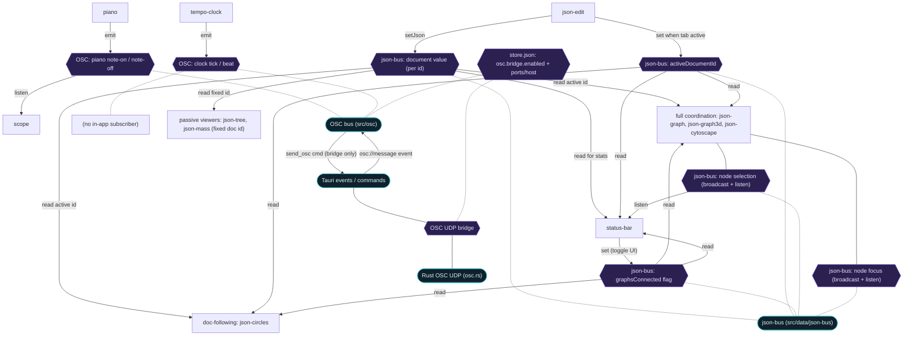
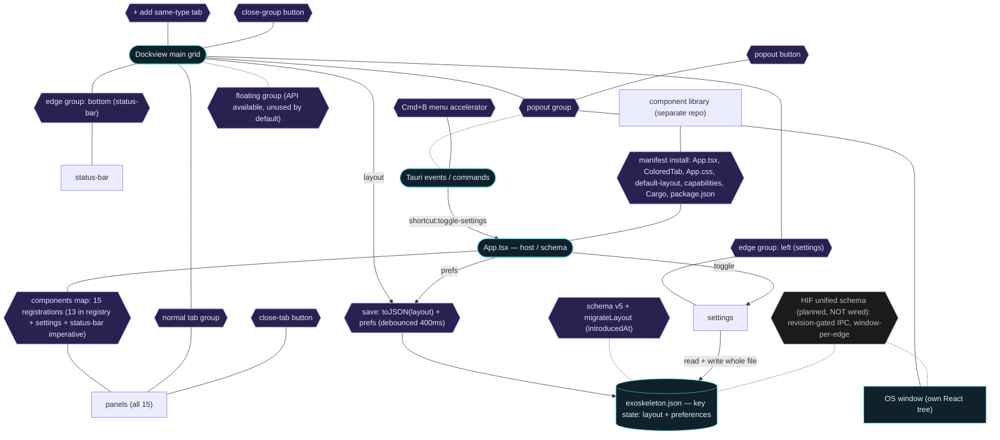

# Architecture Hypergraph — connections & groups (current state)

**Status:** descriptive map, verified against source on 2026-05-25. **No
recommendations** — this records what exists. Where the code and the prose docs
disagree, that's noted in §6 as an observation, not a fix.

**Supersedes** the 2026-05-25 sketch (which collapsed the six JSON viewers into
one node and under-described the json-bus coordination layer, the status bar,
the Rust side, and persistence). Those were inferences; this pass reads the
source.

**Scope:** the connections-and-groups subsystem — runtime buses, Dockview group
types, persistence, the cross-process boundary, chrome operations, and the
cross-repo install contract. Not every file in the tree.

## 1. Method (so the confidence is auditable)

Read in full this pass: every panel in `src/panels/**` (all 15 registered
components), `src/osc/{index,types}.ts`, `src/data/json-bus.ts`,
`src/data/json-utils/{graphDetect,layers}.ts`, `src/App.tsx`, `src/HeaderActions.tsx`,
`src/persistence/{storage,tauri-storage,default-layout}.ts`,
`src-tauri/src/{lib.rs,osc.rs}`, `src/panel-manifest.ts`, and the docs
(`AGENTS-FAQ`, `panel-contract-proposal`, `patchbay-spec`,
`research/dockview-constructive-vs-consumptive`, the HIF doc, both repo READMEs +
CLAUDE + SESSIONS). Not opened (treated as low-risk, behaviour inferred from
their consumers and the proposal doc): `ColoredTab.tsx`, `PanelRoot.tsx`,
`Watermark.tsx`, the `.css` files, `json-utils/jsonToHierarchy.ts`,
`research/osc-self-contained-by-default.md`. See §7 for the full coverage table.

## 2. How to read the diagrams

Incidence form, so it's an honest hypergraph despite Mermaid only doing binary
edges. **Rounded boxes** = entities (buses, the grid, the state file, windows).
**Hexagons** = hyperedges — a relation promoted to a node so it can touch many
entities at once; follow *all* lines out of a hexagon to read the N-ary
connection. **Solid arrows** carry real direction (emit, setJson, set, read,
save). **Dotted lines** mean "lives on / belongs to / gated by." Two diagrams,
split along the two axes that were the source of confusion: connections, then
groups+persistence.

## 3. Diagram A — runtime connections (in-process, not persisted)

## 4. Diagram B — groups, persistence & chrome

## 5. Per-mechanism breakdown (exact producers / consumers)

### 5.1 OSC bus (`src/osc/index.ts`) — ephemeral events

In-process pub/sub by default; OSC address pattern → regex matching. Addresses
in the running app:

- `/exoskeleton/piano/note-on` `[int midi, int velocity]` — emitted by **piano**, heard by **scope**.
- `/exoskeleton/piano/note-off` `[int midi]` — emitted by **piano**, heard by **scope**.
- `/exoskeleton/clock/tick` `[]` and `/exoskeleton/clock/beat` `[int beat]` — emitted by **tempo-clock**; **no in-app subscriber** (see §6.5).

Optional UDP bridge (`src-tauri/src/osc.rs`), off by default, gated by
`store.json` → `osc.bridge.enabled`. When on: JS `sendOsc` also invokes the
`send_osc` Tauri command (UDP to `osc.targetHost:osc.targetPort`, default
`127.0.0.1:8000`); Rust binds `osc.receivePort` (default 9000, ephemeral
fallback) and re-emits inbound packets as `osc://message` events the JS bus
re-dispatches. The flag is read once at startup on both sides — toggling needs a
relaunch.

### 5.2 json-bus (`src/data/json-bus.ts`) — one document primitive + four coordination concerns

This file holds five distinct concerns. Producer/consumer per concern:

| Concern | Functions | Producer(s) | Consumer(s) |
|---|---|---|---|
| Document value | `getJson` / `setJson` / `onJsonChange` (keyed by id) | `json-edit` (`setJson`, debounced parse, id default `"default"`, configurable) | `json-tree`, `json-mass` (fixed id); `json-circles`, `json-graph`, `json-graph3d`, `json-cytoscape` (active id when connected); `status-bar` (active id, for stats) |
| `activeDocumentId` | `get/set/onActiveDocumentIdChange` | `json-edit` (sets to its id when its tab becomes active) | `json-circles`, `json-graph`, `json-graph3d`, `json-cytoscape`, `status-bar` |
| `graphsConnected` flag | `are/set/onGraphsConnectionChange` (default `true`) | **`status-bar`** only (the COORDINATED LINK / DECOUPLED toggle button) | `json-circles`, `json-graph`, `json-graph3d`, `json-cytoscape`, `status-bar` |
| Node selection | `broadcastNodeSelection` / `onNodeSelectionBroadcast` / `getSelectedNode` | `json-graph` (mouseover/out), `json-graph3d` (hover), `json-cytoscape` (mouseover/out) — all gated by `graphsConnected` | same three (highlight; ignore own + non-active-doc) + `status-bar` (Selected Node display) |
| Node focus | `broadcastNodeFocus` / `onNodeFocusBroadcast` | `json-graph` (click), `json-graph3d` (click), `json-cytoscape` (tap) — gated | same three (zoom/center). **Not** `status-bar` |

The six viewers therefore form **three tiers**, not one block: **passive**
(`json-tree`, `json-mass` — `getJson`/`onJsonChange` on a fixed id, no
coordination); **doc-following** (`json-circles` — follows active doc + the
connection flag, but no selection/focus); **full coordination** (`json-graph`,
`json-graph3d`, `json-cytoscape` — all five concerns).

### 5.3 Shared transforms (not buses — pure functions)

`json-utils/graphDetect.ts` (`detectGraph`: recognizes `{nodes, edges|links}`,
arrays of edge-objects, single-rooted) — used by the three full viewers +
`status-bar`. `json-utils/jsonToHierarchy.ts` — used by `json-tree`,
`json-circles`, `json-mass`. `json-utils/layers.ts` (`colorForLayer`,
`buildLayerVisibility`) — drives the per-layer toggle UI in the three full
viewers; each panel's `layerVisibility` map persists in its own params.

### 5.4 Tauri events / commands (`src-tauri/src/lib.rs`, `osc.rs`)

- Command `send_osc` (JS→Rust) — UDP send; only invoked when the bridge is on.
- Event `osc://message` (Rust→JS) — inbound UDP, only when the bridge is on.
- Event `shortcut:toggle-settings` (Rust→JS) — a "View" menu item with
  `CmdOrCtrl+B`; fires at the OS level so it works even when focus is inside the
  webview iframe or xterm.
- Plugins registered: `opener`, `fs`, `dialog`, `pty`, `store`, `log`.

### 5.5 Per-panel Tauri / persistence surface

- **editor** — `plugin-dialog` (open/save) + `plugin-fs` (read/write text). Holds path/text in local state only; **does not persist** them (no `params`).
- **json-edit** — same `dialog`+`fs` surface for JSON files. Persists its *config* params (theme, font, `documentId`, …) but not the buffer (buffer is local, seeded from the bus).
- **terminal** — `tauri-pty` (`spawn` `/bin/zsh`, or `powershell.exe` on Windows); bidirectional data + resize.
- **webview** — plain `<iframe>`, no Tauri plugin; persists its URL via `params`.
- **settings** — reads and writes the *entire* `exoskeleton.json` via `tauriStorage` (apply button); changes apply on next launch for layout, next render for prefs.
- **tempo-clock**, **scope** — persist params (bpm/playing; logVisible) via `updateParameters`.

### 5.6 Persistence — two store files (both via `tauri-plugin-store`)

1. **`exoskeleton.json`**, key `state` → `AppState { version, layout: SerializedDockview, preferences? }`. Written by App's debounced 400 ms save on layout-change / active-panel-change; read on startup; also read+written wholesale by the settings panel.
2. **`store.json`** → OSC bridge config (`osc.bridge.enabled`, `osc.receivePort`, `osc.targetHost`, `osc.targetPort`). Read by the JS OSC bus (just `enabled`) and the Rust OSC setup (all keys). No in-app UI writes it today — hand-edited.

Schema: `CURRENT_VERSION = 5`; `isCompatible` accepts 1–5. `panelRegistry`
(13 entries, each with `introducedAt`) drives `buildDefaultLayout` (fresh) and
`migrateLayout` (adds panels newer than the saved version, preserving the user's
arrangement; drops the position if the reference panel was closed). `settings`
and `status-bar` are **not** in the registry — added imperatively in App.tsx.
`Preferences` is currently an empty interface.

### 5.7 Groups (Dockview) — types, default arrangement, operations

- **Types:** *normal tab group* (panels as tabs); *edge group* (constructive —
  left = settings @320px, bottom = status-bar @40px header-hidden; auto-removed
  when emptied); *popout group* (consumptive — `addPopoutGroup` → a Tauri
  `WebviewWindow`, its own React tree, so the in-process buses do **not** reach
  it); *floating group* (`addFloatingGroup` exists but no UI triggers it today).
- **Default arrangement** (`default-layout.ts`): `editor` | `webview` (right of
  editor); `terminal`+`tempo-clock`+`piano`+`scope` as one tab group (below
  editor); `json-edit` (below editor); `json-tree`+`json-graph`+`json-cytoscape`+
  `json-graph3d`+`json-circles`+`json-mass` as one tab group (right of json-edit).
- **Operations (chrome):** close-tab (`ColoredTab` ×); add-same-type-tab
  (`+`, LeftHeaderActions); popout (`⤴`) and close-group (`⨯`, RightHeaderActions);
  Cmd+B toggles the settings edge group (Rust menu → `shortcut:toggle-settings`).
- **Registration chrome:** `exoPanel(Component, accent)` wraps each entry with a
  `PanelRoot` carrying `--panel-accent`; `ColoredTab` maps id→accent + id→glyph.
  `status-bar-panel` is registered **raw** (no `exoPanel`) — no stripe/PanelRoot.

### 5.8 Cross-repo install contract

Library panels ship a `manifest.ts` (`PanelManifest`). Installing one edits
App.tsx, ColoredTab, App.css, default-layout, `capabilities/default.json`,
`Cargo.toml`/`lib.rs`, `package.json`. Manual + agent today; a future
`npx exoskeleton-install` is noted. **TopoViewer lives in the library and is
not in this app's components map** — it is not a running panel here.

### 5.9 HIF (`docs/Dockview Tauri Hypergraph JSON.md`) — planned, not wired

A whitepaper proposing HIF (Hypergraph Interchange Format) as a future single
source of truth for both Dockview layout and Tauri OS-window topology, with
Rust-as-source-of-truth and revision-gated IPC for multi-window sync. **None of
it is implemented.** It names the concepts that would replace the in-process
buses once popout windows need shared live state.

## 6. Observations — where code and docs disagree (factual, not prescriptive)

1. **README persistence shape is stale.** The README documents a `sideGrid`
   field and `preferences.sideGridVisible` in the on-disk JSON; schema v3 removed
   both (per `storage.ts`), and App's `save()` writes only
   `{ version, layout, preferences }`.
2. **Panel count.** README/CLAUDE (and the earlier sketch) say "14 panels"; the
   `components` map has **15** keys. 13 are in the default-layout registry;
   `settings` and `status-bar` are added imperatively.
3. **The `+` add-tab button is broken for hyphenated ids.** `LeftHeaderActions`
   computes `component: active.id.split("-")[0]`. For `json-edit` that's `"json"`,
   for `tempo-clock` that's `"tempo"` — neither is a registered component. So
   "+" only works for single-word ids (editor/terminal/webview/piano/scope/
   settings) and fails for every `json-*` and `tempo-clock` panel. The prefix
   accent-dot uses the same split and is therefore transparent for those panels;
   the `accents` map in `HeaderActions.tsx` also only lists editor/terminal/webview.
4. **`status-bar` registered without `exoPanel`** — intentional-looking (it owns
   full-width chrome) but means it bypasses the `PanelRoot` accent convention.
5. **The clock has no in-app listener.** `tempo-clock` emits `/exoskeleton/clock/*`
   but `scope` subscribes only to piano addresses; nothing consumes clock ticks
   in-process today (meaningful only via the UDP bridge to an external listener).
6. **editor content isn't persisted** (no `params`), so an open file/buffer is
   lost on reload; `json-edit` persists config but likewise not its buffer.
7. **Selection is both event and snapshot.** `json-bus` keeps
   `currentSelectedNode` *and* broadcasts selection as an event — mixing the two
   semantics the AGENTS-FAQ separates (ephemeral event vs snapshot state).
8. **OSC bridge config has no UI** (`store.json` is hand-edited) — matches the
   SESSIONS open item.

## 7. Coverage — verified vs not-read

**Verified in source this pass:** all 15 panels' bus + Tauri usage; `osc/{index,types}`;
`json-bus`; `lib.rs`; `osc.rs`; `persistence/{storage,tauri-storage,default-layout}`;
`HeaderActions`; `json-utils/{graphDetect,layers}`; `panel-manifest`; and the docs
(`panel-contract-proposal`, `patchbay-spec`, `dockview-constructive-vs-consumptive`,
HIF, READMEs/CLAUDE/SESSIONS).

**Not opened (low risk; behaviour inferred):** `ColoredTab.tsx`, `PanelRoot.tsx`,
`Watermark.tsx`, the `.css` files, `json-utils/jsonToHierarchy.ts`,
`research/osc-self-contained-by-default.md`.

**Deliberately out of scope (not in the running app):** `patchbay-spec.md` (spec
only, unbuilt); library panels not installed here (`harolds-zerof-imagebrowser`,
`topoviewer`, `inbox/*`); the HIF future architecture (§5.9).
