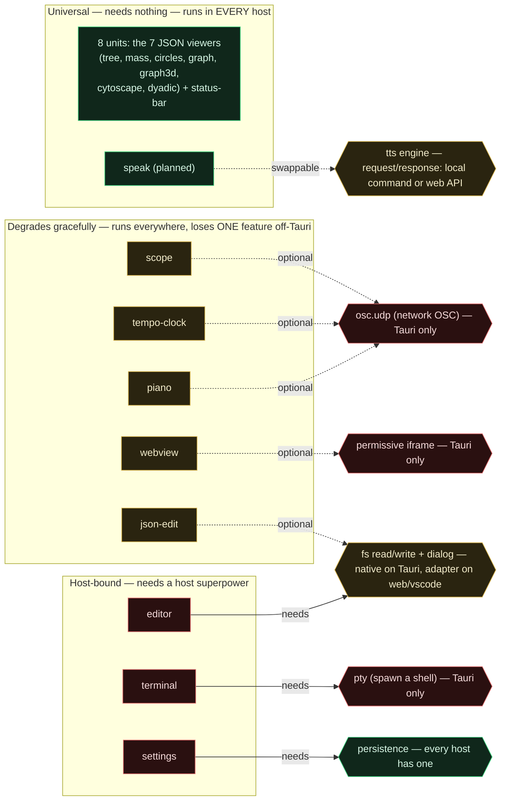

# Panel Capability Map

What each of the 16 exoskeleton panels needs from its host — and therefore where it can run. A unit runs in any host that provides the capabilities it declares. Most declare nothing.

## How to read it

Three tiers, by how much a unit depends on the host:

- **Universal** — needs nothing. Runs unchanged in any host (Tauri, a plain web build, a VSCode webview). Fork-proof.
- **Degrades gracefully** — runs everywhere, but loses one feature when the host isn't Tauri. The dependency is *optional* (dotted arrow).
- **Host-bound** — has a hard requirement (solid `needs` arrow).

Capability color tells you where that power exists: **green** = every host has it; **amber** = available via a small per-host adapter; **red** = Tauri only. So the only true weld is a red unit pointing at a red capability.

## The takeaway

One hard weld (`terminal` → `pty`), two glue-points (`editor` and `json-edit` need a filesystem adapter; `settings` needs persistence, which every host already has), and everything else free. All seven JSON viewers — including the new `json-dyadic` — plus the status bar are universal today. `speak` lands in the universal tier with its TTS engine behind a swappable request/response seam.

## The declarable capability vocabulary

The right-hand column is the whole list a unit might declare in its manifest:

| Capability | Where it exists | Used by |
|---|---|---|
| `pty` | Tauri only | terminal (required) |
| `osc.udp` | Tauri only | piano, tempo-clock, scope (optional) |
| `iframe.permissive` | Tauri only | webview (optional) |
| `fs` (read/write/dialog) | native on Tauri, adapter on web/vscode | editor (required), json-edit (optional) |
| `persistence` | every host | settings (required) |
| `tts.engine` | swappable (local command or web API) | speak (planned) |
| *(none)* | every host | the 7 viewers + status-bar |

Concrete next step: add a `capabilities: string[]` field to `panel-manifest.ts` and fill it for all 16 — `[]` for the universal tier, `["pty"]` for terminal, and so on — so a host can refuse, at install time, anything it can't run.
